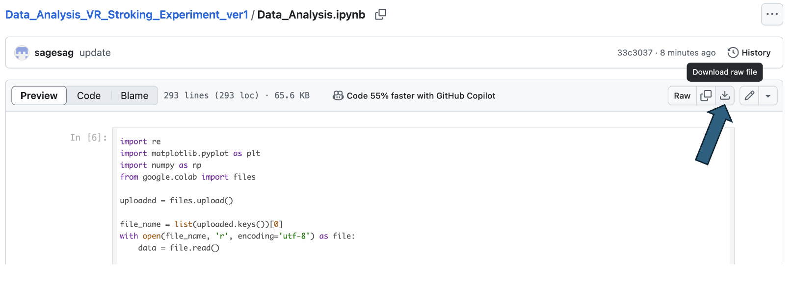

# 実験データの解析

「VRアバターを介して腕を撫でられた際に触覚刺激の有無が心地よさの知覚に及ぼす影響調査」の実験データを解析するためのコードを格納してあります。自身の実験結果が気になる方は是非利用してください。

## 使い方

現在このリポジトリに格納されているファイルは
- Data_Analysis.ipynb

のみです。このファイルをクリックして、下の画像のようにダウンロードしてください。

このファイルはGoogleColaboratory内で動きます。検索窓に「googlecolab」と入力すると
