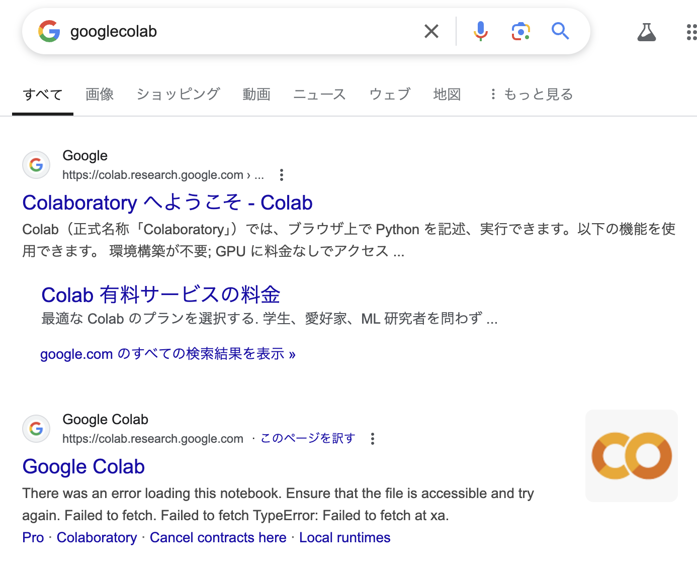
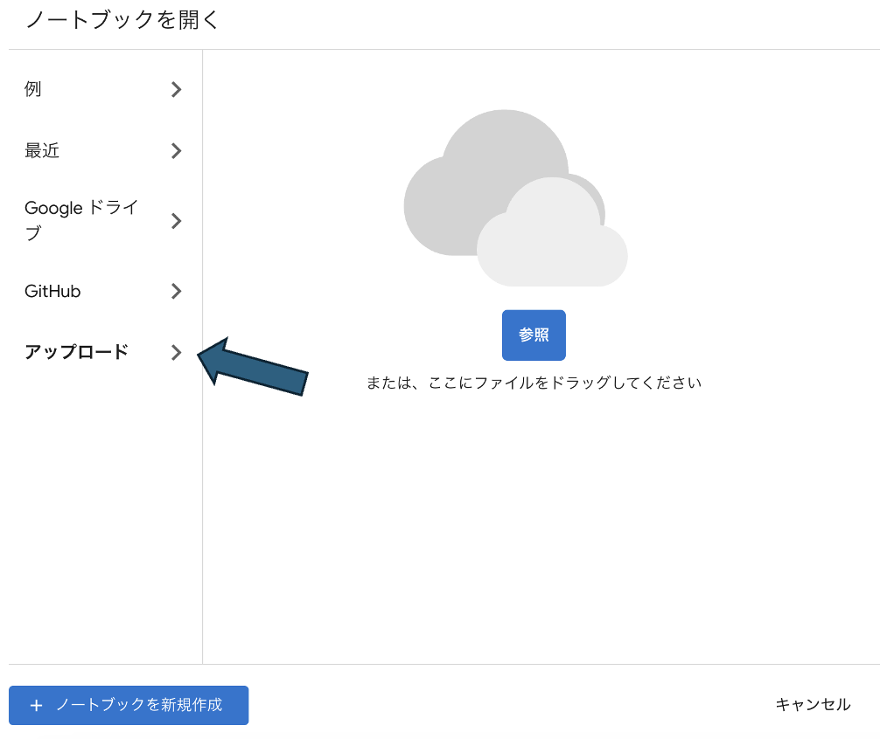
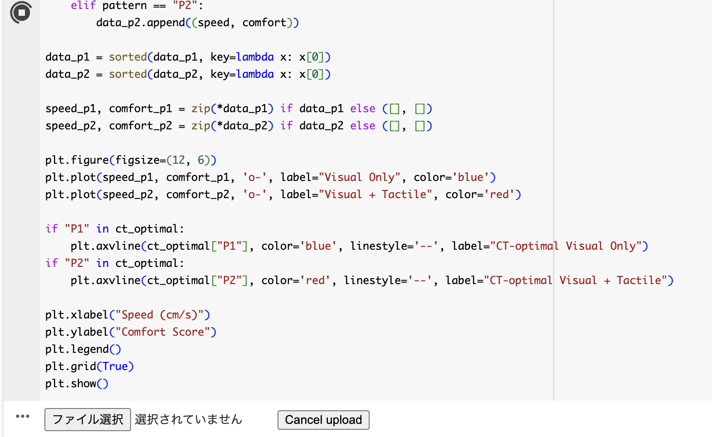

# 実験データの解析

「VRアバターを介して腕を撫でられた際に触覚刺激の有無が心地よさの知覚に及ぼす影響調査」の実験データを解析するためのコードを格納してあります。自身の実験結果が気になる方は是非利用してください。

## 使い方

現在このリポジトリに格納されているファイルは
- Data_Analysis.ipynb

のみです。このファイルをクリックして、下の画像のようにダウンロードしてください。


このファイルはGoogleColaboratory内で動きます。検索窓に「googlecolab」と入力すると一番上に「Colaboratoryへようこそ」と出てくるはずなので、このサイトをクリックしてください。



クリックすると下の画像のような画面が出てくると思います。左の「アップロード」の欄をクリックして「参照」内に先ほどダウンロードしたData_Analysis.ipynbをアップロードしてください。



アップロードをするとコードが表示されます。左上にある再生ボタンのようなものを押すと下の方に「ファイル選択」ボタンが出てくると思います。このボタンを押して、VRChatのログデータを選択してください。ログデータは
```
C:/Users/(ユーザー名)/Appdata/LocalLow/VRChat/vrchat
```
にoutput_log_(実験を行った日時).txtという形で格納されています。



## グラフの読み方

ログデータを選択した後、数秒程度待機すると下の画像のようなグラフが出力されるはずです。これがあなたの実験結果になります。以下にこのグラフの読み方を記します。


### 横軸

腕を撫でる速度です。

### 縦軸

心地よさの値です。実験中に説明した通り、-10が不快の最大、10が快の最大となっています。

### グラフの色

実験中、２つのパターンで撫でてもらいました。それぞれのパターンの結果を色別に示しています。青色が**現実の腕を撫でずにアバターの腕を撫でた場合**、赤色が**現実の腕も撫でながらアバターの腕を撫でた場合**です。

### ２本の点線

最適速度です。

## 研究背景とグラフで確認してほしい部分

人間の有毛部分にはC触覚繊維と呼ばれる神経繊維があり、この神経繊維が発火すると心地よさを感じます。緊張した時に顔を触ったりして気持ちを落ち着かせたり、腕などを撫でられて安心するというのもこのC触覚繊維が関係しています。このC触覚繊維には面白い性質があります。それは特定の速度に対して発火頻度が上がるというものです。つまり、極端に撫でる速度が速かったり遅かったりするとあまり心地よさは生まれず、1~10cm/s程度の速度で撫でたときに一番心地よく感じることができます(実験中はこの速度のことを「最適速度」と呼んでいました
)。

ここで一度実験結果のグラフを見てみましょう。赤色のグラフに着目してください。これは**現実の腕も撫でながらアバターの腕を撫でた場合**のグラフです。(現実の)自分の腕を見ているわけではないため少し結果が異なるかもしれませんが、大半の人が山なりのグラフを描いており、C触覚繊維の速度選択性が確認できると思います。

ここからがこの研究の本題になります。以下の論文はこの研究の元になったものです。

[Reduced C-afferent fibre density affects perceived pleasantness and empathy for touch](https://www.researchgate.net/publication/50289290_Reduced_C-afferent_fibre_density_affects_perceived_pleasantness_and_empathy_for_touch)

触覚刺激だけでなく、動画で撫でられる様子を見たときに撫でられている人が心地よいと思うかを健常者とC繊維が少なくなる遺伝疾患の患者について聞いた結果が書かれています(6ページ目の右のグラフ)。この結果を見てみると映像のみでも触覚刺激があった場合と同じように心地よさを感じられることがわかります。メタバースで撫でる、撫でられると安心するというのは、これの一種かと思いますが、ビデオは撫でられている人についての推測なので、自分自身が撫でられているVRで感じる感覚とは違いそうです。

この背景を念頭に置いて青色のグラフを着目してください。赤色のグラフと同じような心地よさの値になっているでしょうか？最適速度はほとんど一緒でしょうか？正直どのような振る舞いをするのか全くわかりません。この研究を通して、視覚情報のみで触覚ありと同じように知覚できるのか、限界はあるのかなどを探っていければと思います。

## 最後に

今回は実験に参加していただき本当にありがとうございました。本実験で個人差なども見てみたいため、ある程度データ数を確保したいと考えています。できればでいいのですが、お知り合いの方々も実験に誘っていただけると助かります。
