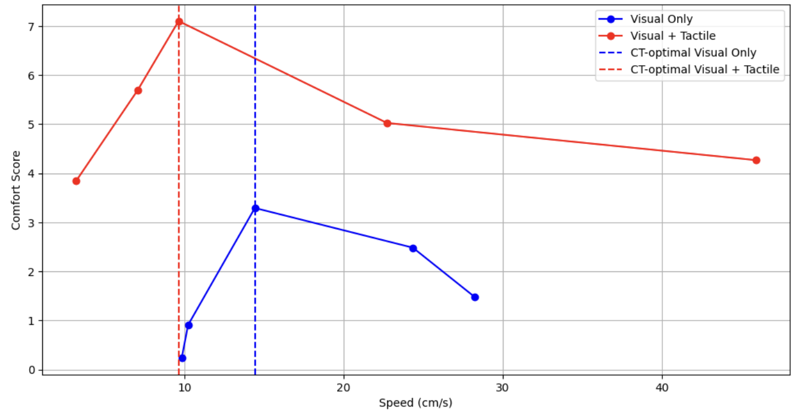

# 実験データの解析

「VRアバターを介して腕を撫でられた際に触覚刺激の有無が心地よさの知覚に及ぼす影響調査」の実験データを解析するためのコードを格納してあります。自身の実験結果が気になる方は是非利用してください。

## 使い方

現在このリポジトリに格納されているファイルは
- Data_Analysis.ipynb

のみです。このファイルをクリックして、下の画像のようにダウンロードしてください。


このファイルはGoogleColaboratory内で動きます。検索窓に「googlecolab」と入力すると一番上に「Colaboratoryへようこそ」と出てくるはずなので、このサイトをクリックしてください。


クリックすると下の画像のような画面が出てくると思います。左の「アップロード」の欄をクリックして「参照」内に先ほどダウンロードしたData_Analysis.ipynbをアップロードしてください。


アップロードをするとコードが表示されます。左上にある再生ボタンのようなものを押すと下の方に「ファイル選択」ボタンが出てくると思います。このボタンを押して、VRChatのログデータを選択してください。ログデータは
```
C:/Users/(ユーザー名)/Appdata/LocalLow/VRChat/vrchat
```
に格納されています。


## グラフの読み方

ログデータを選択した後、数秒程度待機すると下の画像のようなグラフが出力されるはずです。これがあなたの実験結果になります。以下にこのグラフの読み方を記します。



### 横軸

腕を撫でる速度です。

### 縦軸

心地よさの値です。実験中に説明した通り、-10が不快の最大、10が快の最大となっています。

### グラフの色

実験中、２つのパターンで撫でてもらいました。それぞれのパターンの結果を色別に示しています。青色が**現実の腕を撫でずにアバターの腕を撫でた場合**、赤色が**現実の腕も撫でながらアバターの腕を撫でた場合**です。

### ２本の点線

最適速度です。

## 研究背景とグラフで確認してほしい部分

以下の論文はこの研究の元になったものです。

[Google](https://www.researchgate.net/publication/50289290_Reduced_C-afferent_fibre_density_affects_perceived_pleasantness_and_empathy_for_touch)
